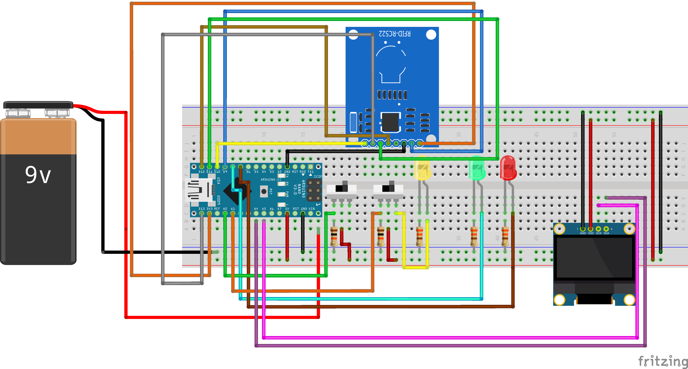

# Arduino RFID Cloner

To ensure proper functioning of the code, you need to install the following libraries:

-   MFRC522
-   LiquidCrystal_I2C

## About the Project

This project allows you to clone RFID tags and cards operating at a frequency of 13.56 MHz.

## How to Copy Data:

To copy data from one card to another, follow these steps:

1. Begin by placing the card from which you want to copy data.
2. Switch the toggle switch.
3. Now, place the second card.

## Required Components:

-   1 Arduino (preferably Nano)
-   1 MFRC522
-   1 switch
-   1 breadboard
-   Male-to-male jumper wires
-   Power source
-   13.56MHz RFID cards/keychains with write capability
-   3 LEDs
-   5 resistors { 3x 220 Ω (for LEDs), 2x 10000 Ω (for switches) }
-   2 switches
-   1 LCD screen 1602
-   1 HD44780 I2C LCD Converter

Please make sure to wire the components as specified in the project documentation for proper functionality.

## Schematic

